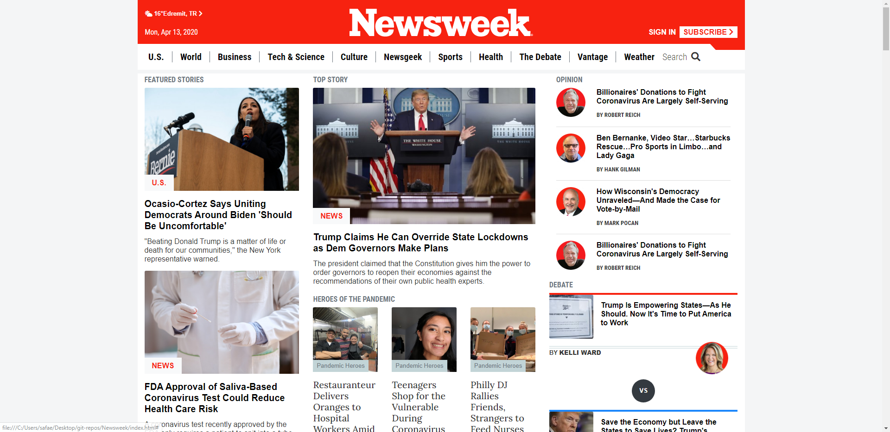

# Newsweek Home Page Replica

> This project is a clone of Newsweek home page. It makes use of Bootstrap, float, flex and grid CSS display positioning styles. This was completed as part of the Microverse remote software developement curriculum using the solo programming approach. Additionally a basic JavaScript method used to make navbar dynamic depends on the scroll action. Content of the webpage is copied from [that](https://www.newsweek.com/) original page.

## Built With

- HTML5,
- CSS3,
- Bootstrap,
- Javascript

## Live Demo

[Live Demo Link](https://rawcdn.githack.com/SafaErden/Newsweek/23127419cd29bf77533e45a772dd1cc6d4a2b78e/index.html)

### Prerequisites

-Any kind of browser suooprting CSS3 and HTML5

### Setup

-Fork the repo to your remote repository.
-Clone or download the repository to your local machine.

### Install

-No istallation needed.

### Usage

-Visit the live demo link on your web browser.

## Author

👤 **Safa ERDEN**

- Github: [@safaerden](https://github.com/SafaErden)
- Twitter: [@safaerden](https://twitter.com/safaerden)
- Linkedin: [SafaErden](https://www.linkedin.com/in/safaerden/)
- Email: [safaerden](mailto:safaerden@gmail.com)

## 🤝 Contributing

Contributions, issues and feature requests are welcome!

Feel free to check the [issues page](https://github.com/SafaErden/Newsweek/issues).

## Show your support

Give a ⭐️ if you like this project!

## Acknowledgments

- TheOdinProject.com PROJECT: USING BOOTSTRAP

